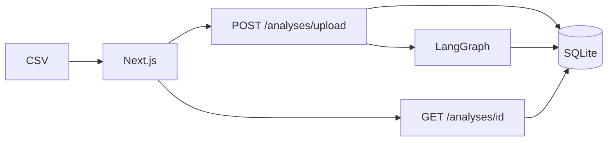

# Insight Lab

**Beyond positive/negative sentiment** — a minimal end-to-end demo for the CVM-AI YouTube channel.

Upload customer verbatims (CSV) → **LangGraph** + **LLM** → management report (themes, churn, inferred NPS, deep dive on extra columns).

---

## What you get

| Layer | Tech | Role |
|-------|------|------|
| **Frontend** | Next.js + shadcn | Sidebar analyses, job progress, management report |
| **API** | FastAPI | Upload job, poll report, CSV export, delete |
| **Pipeline** | LangGraph | `prepare → analyze_one (loop) → rollup → enrich? → summarize?` |
| **Storage** | SQLite | Datasets, extras, jobs, rollups |

**Key idea:** the LLM writes **per-verbatim JSON**. Charts and inferred NPS come from **Python rollups**.

See **[HOW_IT_WORKS.md](HOW_IT_WORKS.md)** for a short code walkthrough.

---

## Quick start

### 1. Backend

**Requires Python 3.10+**

```bash
cd backend
python3.12 -m venv .venv
source .venv/bin/activate
pip install -r requirements.txt
cp .env.example .env   # set LLM_PROVIDER / model / keys as needed

uvicorn app.main:app --reload --port 8000
# or: python -m app.main
```

### 2. Frontend

```bash
cd frontend
npm install
cp .env.example .env.local   # optional; defaults to http://localhost:8000
npm run dev
```

Open [http://localhost:3000](http://localhost:3000).

### 3. Try it

1. Upload a CSV from `sample-data/` (prefer an enriched file with channel/region/…)
2. Wait for the job (sidebar polls)
3. Open the report — commentary, scorecards, themes, deep dive

---

## Data flow



---

## CSV format

**Required:** one text column (`verbatim`, `text`, `feedback`, `comment`, `message`, or `review`).

**Optional first-class:** id, timestamp.

**Everything else** (ratings, NPS, channel, product, region, …) is stored in **`extras`** and used by enrich when suitable.

Examples: `sample-data/`.

---

## Project layout

```
insight-lab/
├── HOW_IT_WORKS.md        # Code guide (tracked in git)
├── README.md
├── sample-data/
├── backend/
│   └── app/
│       ├── graphs/verbatim_insights/   # LangGraph
│       ├── pipeline/                   # skip, rollup, enrich, summary, jobs
│       ├── shared_services/            # llm, db
│       ├── main.py
│       └── store.py
├── frontend/
└── docs/                  # YouTube / presenter notes (gitignored)
```

---

## Configure LLM

```bash
# backend/.env
LLM_PROVIDER=ollama        # ollama | openai | gemini
OLLAMA_MODEL=llama3.2
# OPENAI_API_KEY=sk-...
# GOOGLE_API_KEY=...
```

Analysis needs a working provider. `engine` in API responses is the model name.

---

## Docs

| Doc | In git? | Purpose |
|-----|---------|---------|
| [HOW_IT_WORKS.md](HOW_IT_WORKS.md) | Yes | Understand the code |
| `docs/VIDEO_GUIDE.md` | No | YouTube episode scripts |
| `docs/PIPELINE.md` | No | System + LangGraph (presenter) |

---

## License

MIT — use freely for learning, demos, and your own forks.
