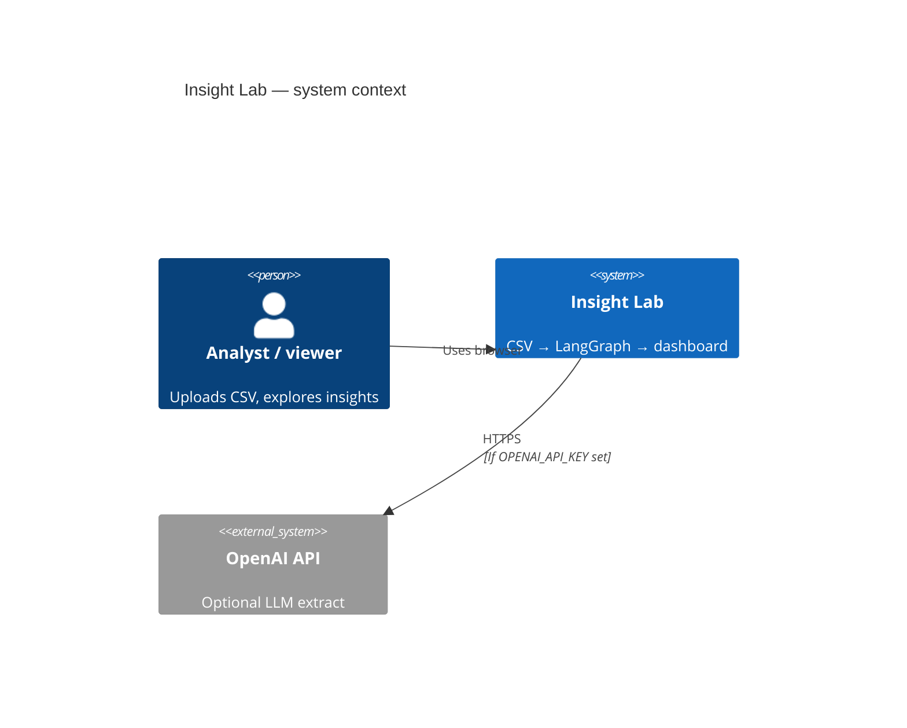
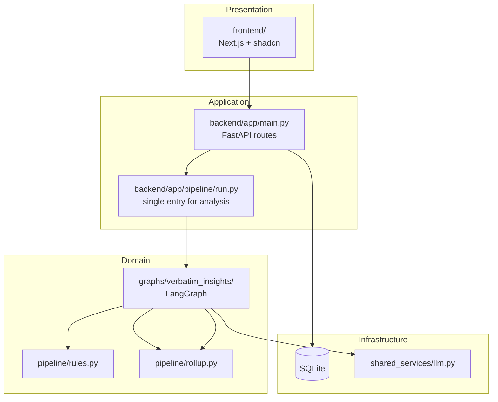
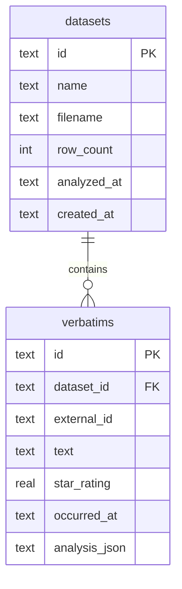

# Architecture

High-level design for Insight Lab — intentionally small, but structured like a real CVM insights product.

---

## System context

---

## Layers

**Rule:** all analysis runs go through `pipeline/run.py` → LangGraph. API routes never call `rules.py` or `llm.py` directly.

---

## Comparison to Echo

| Concern | Echo | Insight Lab |
|---------|------|-------------|
| Graph | `verbatim_analysis` | `verbatim_insights` |
| Loop node | `analyze_one` | `analyze_one` (same pattern) |
| DB | Postgres + pgvector | SQLite |
| Theme taxonomy | Preset + enrich node | Inline theme ids in rules/LLM |
| CSV ingest | Frontend localStorage | Backend upload API |
| Frontend data | Mostly mock | Wired to API |
| Dedup / cache | Postgres exact-text | Not in v1 |
| Enrich themes node | Yes | No (simpler tree) |

Insight Lab is the **teaching repo**; Echo is the **product-shaped** codebase.

---

## API contract

| Method | Path | Body | Response |
|--------|------|------|----------|
| `GET` | `/health` | — | `{ status, database, llm_enabled }` |
| `POST` | `/datasets/upload` | `multipart file` | `{ dataset, preview }` |
| `POST` | `/datasets/sample` | — | loads bundled CSV |
| `GET` | `/datasets` | — | `DatasetSummary[]` |
| `GET` | `/datasets/{id}` | — | `DatasetSummary` |
| `POST` | `/datasets/{id}/analyze` | — | runs graph, saves, returns rollup |
| `GET` | `/datasets/{id}/insights` | — | `InsightsRollup` from DB |
| `GET` | `/datasets/{id}/records` | — | `VerbatimAnalysis[]` |

Base URL (dev): `http://localhost:8000`

Frontend env: `NEXT_PUBLIC_API_URL=http://localhost:8000`

---

## SQLite schema

`analysis_json` stores the full `VerbatimAnalysis` pydantic model after a run.

---

## Three layers of output

Same pattern as Echo (see Echo `verbatim-analysis-langgraph.md`):

| Layer | Producer | Consumer |
|-------|----------|----------|
| **Per-verbatim record** | `analyze_one` | Table rows, drill-down cards |
| **Rollups** | `rollup_batch` / `build_rollup` | KPI cards, theme bars |
| **Narrative** | *not in v1* | Future: LLM on rollups only |

---

## Configuration

| Variable | Default | Effect |
|----------|---------|--------|
| `DATABASE_PATH` | `backend/data/insight_lab.db` | SQLite file location |
| `OPENAI_API_KEY` | unset | Enables `engine=llm` |
| `LLM_MODEL` | `gpt-4o-mini` | Model for extract |

---

## Local development ports

| Service | Port |
|---------|------|
| FastAPI | 8000 |
| Next.js | 3000 |

Run both in separate terminals (see root README).
