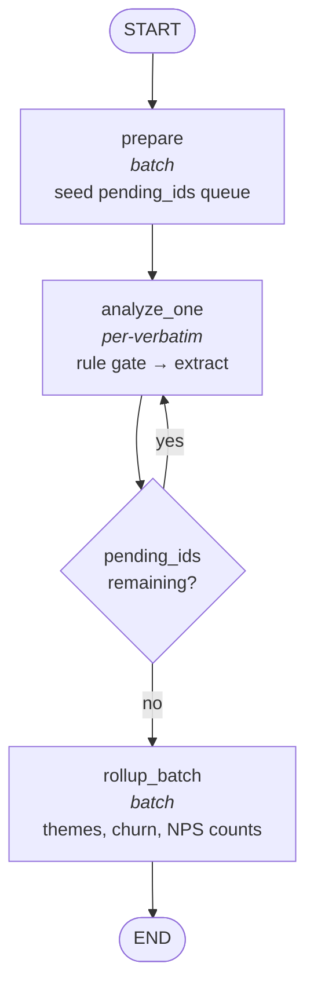
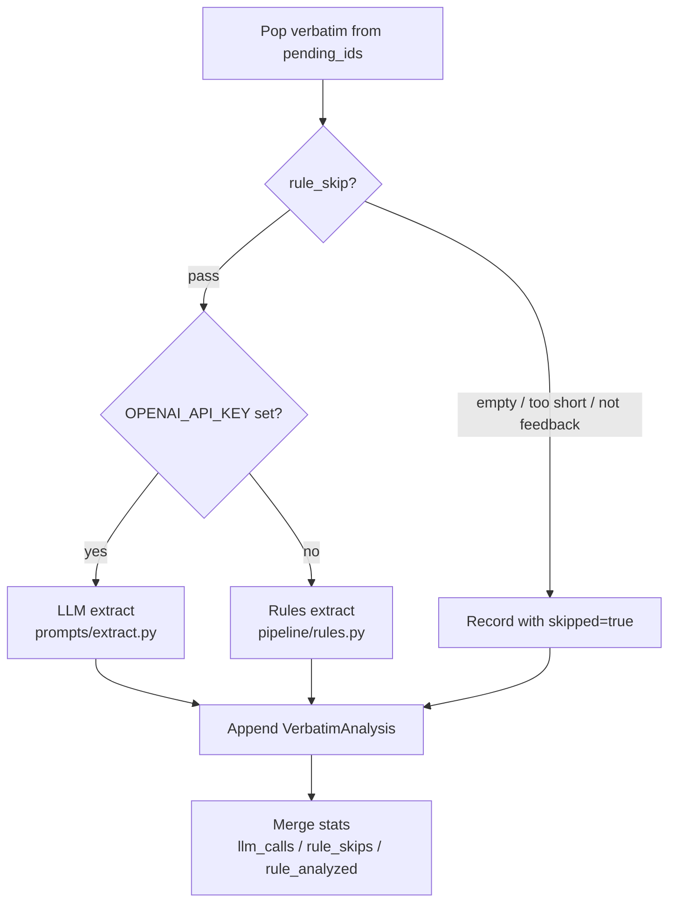
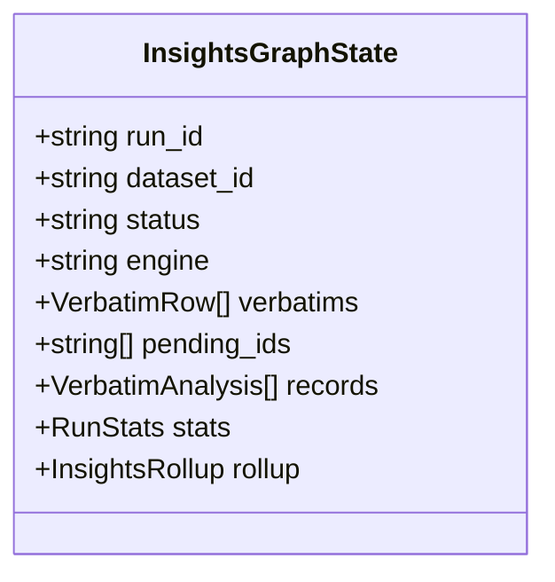
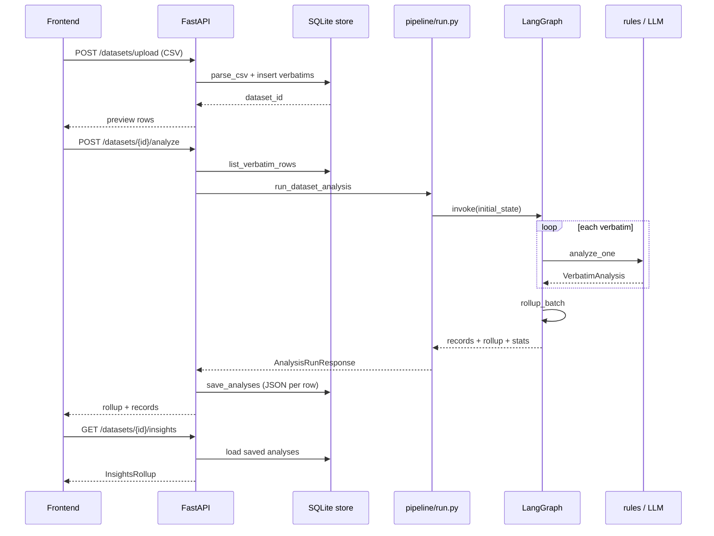

# LangGraph pipeline

This is the **core teaching surface** for Insight Lab. The graph turns each CSV row into a structured insight record, then rolls those records up into dashboard metrics.

> **Principle:** screens show **aggregates**. The graph produces small structured rows per verbatim. Counting those rows gives you KPIs — the LLM does not invent chart numbers.

---

## Graph tree



### Node types

| Node | Runs | What it does |
|------|------|--------------|
| `prepare` | Once | Copy verbatim IDs into `pending_ids`, reset accumulators |
| `analyze_one` | Loop (1× per row) | Pop next ID → rule skip OR rules/LLM extract → append record |
| `rollup_batch` | Once | `Counter` over records → `InsightsRollup` for the UI |

This mirrors Echo's `prepare → analyze_one (loop) → finalize_batch` pattern, without taxonomy enrichment or Postgres dedup (kept simple for video).

---

## Per-verbatim decision tree

Inside `analyze_one`, each verbatim follows this path:



**Rule gate** (`pipeline/rules.py → rule_skip`) is intentionally **outside** the LLM so you can demo zero-cost runs and explain *why* low-signal text is filtered.

---

## State shape

File: `app/graphs/verbatim_insights/state.py`



### Reducers (important for loops)

| Field | Reducer | Why |
|-------|---------|-----|
| `records` | `operator.add` | Each `analyze_one` pass appends one record |
| `stats` | custom merge | Sum `llm_calls`, `rule_skips`, `rule_analyzed` across steps |
| `errors` | `operator.add` | Collect per-step failures without overwriting |

`pending_ids` is **replaced** each step (pop-from-front queue), not appended.

---

## End-to-end data flow



---

## Code map (where to film / extend)

| What | File |
|------|------|
| Graph wiring | `app/graphs/verbatim_insights/graph.py` |
| Nodes | `app/graphs/verbatim_insights/nodes.py` |
| State + reducers | `app/graphs/verbatim_insights/state.py` |
| Pipeline entry | `app/pipeline/run.py` |
| Rule engine (no API key) | `app/pipeline/rules.py` |
| Rollups | `app/pipeline/rollup.py` |
| LLM prompts | `app/prompts/extract.py` |
| Pydantic models | `app/models.py` |

### Suggested video order

1. **CSV → API → SQLite** (`store.py`, `main.py` upload route)
2. **State + graph compile** (`state.py`, `graph.py`) — draw the mermaid tree on screen
3. **`analyze_one` loop** (`nodes.py`) — rule gate vs LLM branch
4. **`rollup_batch`** (`rollup.py`) — why KPIs are code, not LLM
5. **Frontend wiring** — replace mock data with `GET /insights`

---

## Routing detail

```python
# graph.py
graph.add_conditional_edges(
    "analyze_one",
    route_after_analyze,
    {"analyze_one": "analyze_one", "rollup_batch": "rollup_batch"},
)
```

`route_after_analyze` returns `"analyze_one"` while `pending_ids` is non-empty; otherwise `"rollup_batch"`.

**Recursion limit:** `max(25, n + 10)` where `n = len(verbatims)` — LangGraph defaults to 25 steps, but each verbatim costs one `analyze_one` invocation.

---

## Output record (per verbatim)

| Field | Example | UI use |
|-------|---------|--------|
| `sentiment` | `mixed` | Sentiment breakdown chart |
| `emotion` | `frustrated` | Emotion distribution |
| `nps_class` | `detractor` | NPS-style buckets |
| `churn_risk` | `high` | At-risk shortlist |
| `themes[]` | `login_failure` | Top themes bar |
| `issues[]` | `KYC upload friction` | Issues panel |
| `delights[]` | `Fast support resolution` | Delights panel |
| `summary` | one-liner | Card subtitle |
| `key_quote` | first sentence | Evidence snippet |
| `skipped` | `true` | Filtered from rollups |

---

## Rollup (dataset level)

`rollup_batch` calls `pipeline/rollup.py → build_rollup`:

- `Counter` over sentiment, emotion, nps_class, churn_risk
- Top themes / issues / delights
- `high_churn_samples` — up to 5 medium/high churn records for the UI

Same rollups are recomputed on `GET /datasets/{id}/insights` from persisted JSON (idempotent).

---

## Rules vs LLM

| | Rules (`engine=rules`) | LLM (`engine=llm`) |
|--|------------------------|---------------------|
| API key | Not required | `OPENAI_API_KEY` |
| Explainability | Keyword/theme tables in `rules.py` | Prompt in `prompts/extract.py` |
| Cost | Free | ~1 call per non-skipped verbatim |
| Best for | Demos, tests, offline | Production-quality nuance |

Engine is chosen once at `build_initial_state` from `llm_enabled()`.

---

## Future extensions (not in v1)

Echo adds these as separate graph nodes — good follow-up episodes:

- **Dedup cache** — skip LLM when exact text was analyzed before
- **Parallel extract** — thread pool or `Send` API inside LangGraph
- **Narrative node** — LLM summary *on rollups only* (not raw text)
- **Theme taxonomy** — map free-form themes to a preset vocabulary

See Echo's `docs/echo-blueprint.md` for the full production target.
