# Video guide — how to present Insight Lab

A presenter script for the **CVM-AI** channel. This repo is designed to be filmed **in order** — each episode ends with something working, and the LangGraph episode is the centerpiece.

> **Series promise:** “We’re not doing positive vs negative. We’re building an insights pipeline — CSV in, structured records out, dashboard metrics from code.”

---

## Series at a glance

| # | Title (working) | Length | Payoff |
|---|-----------------|--------|--------|
| 0 | Trailer / problem framing | 3–5 min | Why sentiment scores aren’t enough |
| 1 | Repo tour + CSV upload | 12–18 min | Sample CSV → rows in SQLite |
| 2 | FastAPI + the analyze button | 10–15 min | `POST /analyze` returns JSON |
| 3 | **LangGraph — the pipeline** | 25–35 min | Graph loop + rollups explained |
| 4 | Rules vs LLM (two engines) | 15–20 min | Same graph, swap extract path |
| 5 | Frontend + shadcn dashboard | 15–20 min | Upload → analyze → KPI cards |
| 6 | Wrap + what’s next | 8–12 min | Echo comparison, extensions |

**Total:** ~90–120 min of content (one long build or a 6-part mini-series).

---

## Not coding live? Read this first

If you are **narrating over pre-built code** (voiceover + screen recording), **do not publish one 90-minute video** and **do not stretch to seven episodes**.

### Recommendation: **4 focused episodes** (~15–22 min each)

| # | Title | Length | Why it works without live coding |
|---|-------|--------|----------------------------------|
| 1 | **The problem + demo** | 12–15 min | Show finished UI first (wow), then explain what’s missing in pos/neg |
| 2 | **Data in → API out** | 15–18 min | CSV, SQLite, `POST /analyze` — cut between Swagger and DB, no typing |
| 3 | **LangGraph deep dive** | 20–25 min | Your hero episode — static diagrams + slow scroll through `graph.py` / `nodes.py` |
| 4 | **Rules vs LLM + roadmap** | 12–15 min | Toggle engine, compare one verbatim, tease Echo extensions |

**Drop as standalone episodes** (fold into Ep 1–4 as B-roll or 60s Shorts):

- Ep 0 trailer (use as YouTube **preview** or Short, not a numbered episode)
- Dedicated frontend episode (old Ep 5 → **first 3 min of Ep 1**)
- Dedicated wrap episode (old Ep 6 → **last 2 min of Ep 4**)

### Why 4 beats 7 (for voiceover)

| | 7 episodes | 1 long video | **4 episodes** |
|--|------------|--------------|----------------|
| Retention | Risky — thin episodes feel padded | Heavy drop-off after 20 min | Each video has a clear payoff |
| Production | 7 intros/outros, 7 thumbnails | One edit marathon | Reusable diagram assets across 4 |
| Algorithm | More upload surface | One searchable pillar | Playlist + Shorts from clips |
| Non-live fit | Hard to fake “progress” 7 times | Tiring to watch code scroll for 90 min | Narrate **concepts**; code is evidence |

### Non-live filming workflow (dual-screen)

You will **switch between the app, diagram PNGs, and code** on the recorded screen — not code live. That is the intended format.

1. **Prepare presentation pages** — export PNGs listed in [Presentation pages](#presentation-pages-pngs) below.
2. **Start backend + frontend** before you hit record — app stays available the whole session.
3. **Record one screen** (Screen 1): app **or** PNG **or** code editor — never your script notes.
4. **Keep script on Screen 2** — `VIDEO_GUIDE.md`, episode section, talking points.
5. **Say transitions out loud** — “Back in the app…”, “Here’s the graph…” — helps editing.
6. **Return to the app every 2–3 min** when deep in code/diagrams so it still feels like one product.

> **Note:** A separate “record demo first” pass is **optional** — only if you later split voice and screen in an editor. If you narrate while switching live, skip it.

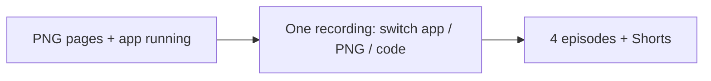

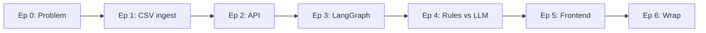

---

## Before you record

### Repo on screen

```bash
git clone <your-public-repo>
cd insight-lab
```

### Terminal layout (keep consistent across episodes)

| Pane | Command |
|------|---------|
| Left | `cd backend && uvicorn app.main:app --reload --port 8000` |
| Right | `cd frontend && npm run dev` (from Ep 5) |
| Optional | `python backend/scripts/run_analysis.py` for CLI-only demos |

### Files to bookmark in your editor

```
sample-data/bank_verbatims.csv
backend/app/store.py
backend/app/main.py
backend/app/pipeline/run.py
backend/app/graphs/verbatim_insights/graph.py
backend/app/graphs/verbatim_insights/nodes.py
backend/app/graphs/verbatim_insights/state.py
backend/app/pipeline/rules.py
backend/app/pipeline/rollup.py
docs/LANGGRAPH.md
```

### One-liner to repeat

> “The LLM (or rules) only writes **one small record per comment**. The dashboard numbers come from **counting those records** — not from asking the model for KPIs.”

---

## Dual-screen filming setup

### Monitor layout

| Screen | What’s on it | Recorded? |
|--------|----------------|-----------|
| **Screen 1** (main) | App (`localhost:3000`) **or** PNG page **or** VS Code | **Yes** |
| **Screen 2** | This guide, script notes, Swagger (`localhost:8000/docs`) | No |

Record **only Screen 1**. Use Screen 2 as your teleprompter / checklist.

### Three views on Screen 1

Switch between these during narration (Cmd+Tab, Mission Control, or OBS scenes):

| View | When to use |
|------|-------------|
| **App** | Demos, payoffs, “here’s what the user sees” |
| **PNG page** | Concepts, graph trees, comparisons — hold 20–45 sec |
| **Code** | Proof — one function, zoomed 16–18px, 20–60 sec |

### Code editor tabs (bookmark before recording)

Open these tabs in order — close everything else:

```
sample-data/bank_verbatims.csv
backend/app/store.py
backend/app/main.py
backend/app/pipeline/run.py
backend/app/graphs/verbatim_insights/graph.py
backend/app/graphs/verbatim_insights/nodes.py
backend/app/graphs/verbatim_insights/state.py
backend/app/pipeline/rules.py
backend/app/pipeline/rollup.py
backend/app/prompts/extract.py
frontend/lib/api.ts
```

### App checklist (before Record)

- [ ] Backend: `uvicorn app.main:app --reload --port 8000`
- [ ] Frontend: `npm run dev` → `http://localhost:3000`
- [ ] Health badge shows green in app header
- [ ] Load sample + run analysis once (confirm dashboard populates)
- [ ] PNG pages exported to `docs/diagrams/` (see below)

### Recording habits

- Pause **half a second** after each screen switch.
- Don’t read code line-by-line — state the idea, flash 3–5 lines.
- Every code/diagram segment should end with: **“That’s why the dashboard shows X.”** → switch to app.

---

## Presentation pages (PNGs)

Export these once from Mermaid ( [mermaid.live](https://mermaid.live) ) or Excalidraw. Save to `docs/diagrams/` with the filenames below. Full-screen them on Screen 1 in Preview or a browser tab.

| Page | Filename | Used in | Source / content |
|------|----------|---------|------------------|
| **P1** | `p1-problem-pos-neg-vs-insights.png` | Ep 1 | Table below — “sentiment vs insights” |
| **P2** | `p2-data-flow-csv-to-db.png` | Ep 1–2 | Mermaid in Ep 1 section |
| **P3** | `p3-api-analyze-sequence.png` | Ep 2 | Mermaid in `LANGGRAPH.md` sequence diagram |
| **P4** | `p4-langgraph-tree.png` | Ep 3 | `prepare → analyze_one → rollup_batch` |
| **P5** | `p5-analyze-one-decision.png` | Ep 3 | Rule skip → rules vs LLM branch |
| **P6** | `p6-state-reducers.png` | Ep 3 | State fields + `operator.add` on `records` |
| **P7** | `p7-rules-vs-llm.png` | Ep 4 | Comparison table (rules vs LLM) |
| **P8** | `p8-full-stack.png` | Ep 4 outro | CSV → API → Graph → UI recap |

### P1 — Problem: sentiment vs insights (build in Excalidraw or slides)

Two columns — no Mermaid needed:

| Positive / negative only | Insight-driven (this repo) |
|--------------------------|----------------------------|
| 62% positive | Top theme: `login_failure` (4) |
| 38% negative | High churn: 3 verbatims |
| No themes | Issues vs delights per row |
| No action list | NPS class + emotion breakdown |

**Talking point:** “Same CSV row — one score hides the story.”

### P2 — Data flow (copy to mermaid.live)

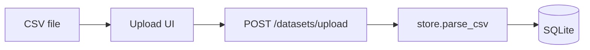

### P3 — Analyze sequence (copy to mermaid.live)

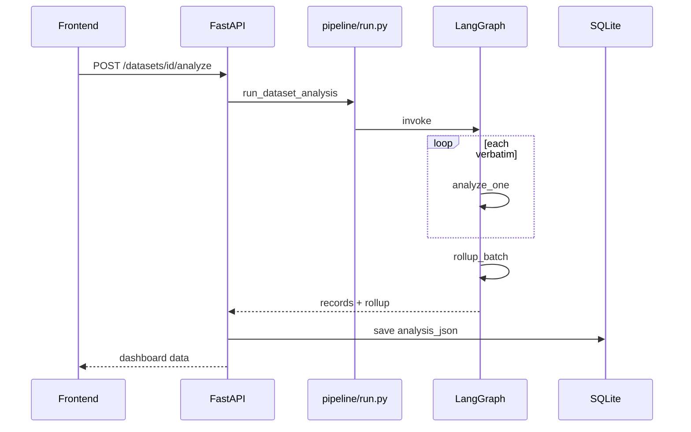

### P4 — LangGraph tree (copy to mermaid.live)

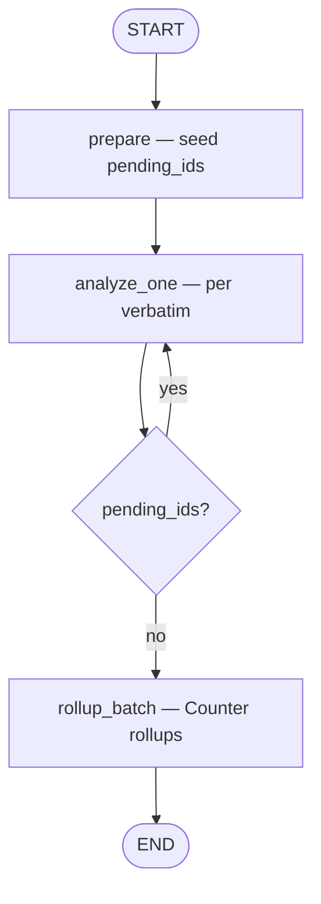

### P5 — Inside analyze_one (copy to mermaid.live)

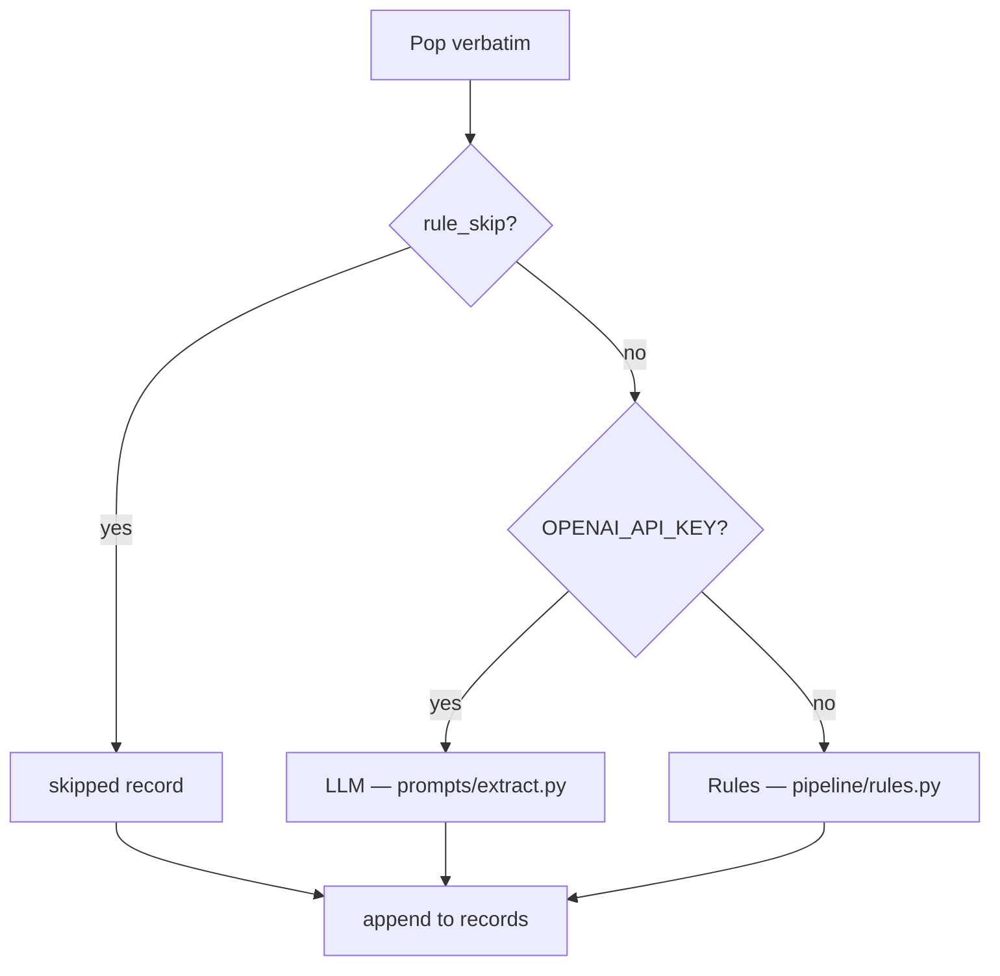

### P6 — State reducers (build as simple diagram)

```
InsightsGraphState
├── verbatims[]        (input, read-only)
├── pending_ids[]      (queue — replaced each step)
├── records[]          (+ operator.add — append per step)
├── stats              (merged: llm_calls, rule_skips, rule_analyzed)
└── rollup             (set once in rollup_batch)
```

### P7 — Rules vs LLM (table graphic)

| | Rules | LLM |
|--|-------|-----|
| API key | Not required | `OPENAI_API_KEY` |
| Cost | Free | ~1 call / verbatim |
| Explainability | `THEME_RULES` keywords | Prompt + JSON schema |
| Best for | Demos, tests, YouTube | Production nuance |

### P8 — Full stack (copy to mermaid.live)

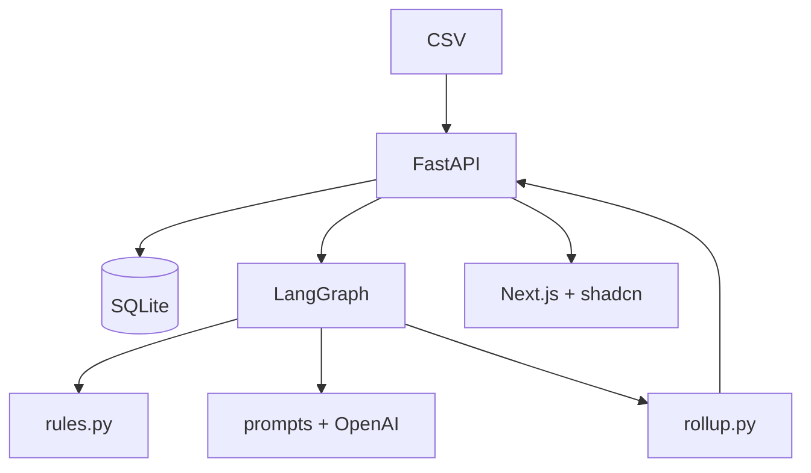

---

## Episode screen scripts (4-episode format)

Use this as your **switching checklist** while recording. **Page** = full-screen PNG; **App** = `localhost:3000`; **Code** = editor tab.

### Episode 1 — The problem + demo (12–15 min)

| Order | Screen | What to show | Say (short) |
|-------|--------|--------------|-------------|
| 1 | App | Dashboard after analyze (pre-loaded) | “This is insight-driven feedback — not a sentiment %.” |
| 2 | Page **P1** | Pos/neg vs insights | “Mood is not action.” |
| 3 | Code | `sample-data/bank_verbatims.csv` → row `v-001` | “Login, payment, switching to Equity — one negative score hides three problems.” |
| 4 | App | Load sample → Run analysis (live click) | “Same pipeline you’ll see in the repo.” |
| 5 | Page **P2** | CSV → SQLite | “We persist first, analyze second.” |
| 6 | Code | `store.py` → `parse_csv` (10 sec) | “Column names are auto-detected.” |
| 7 | App | Upload panel + dataset card | “Ep 2: one API call runs the graph.” |

### Episode 2 — Data in → API out (15–18 min)

| Order | Screen | What to show | Say (short) |
|-------|--------|--------------|-------------|
| 1 | App | Dataset loaded, not yet analyzed | “Rows in DB — no insights yet.” |
| 2 | Code | `main.py` — upload + analyze routes | “Thin API — fat pipeline.” |
| 3 | Code | `pipeline/run.py` | “Every analyze goes through here.” |
| 4 | App | Click **Run analysis** | “One button → LangGraph.” |
| 5 | Page **P3** | Analyze sequence | “Walk this once — you’ll reuse it in Ep 3.” |
| 6 | App | Scroll dashboard + expand one row | “Per-verbatim record → rollup → UI.” |
| 7 | Code | `main.py` analyze handler (5 sec) | “Next: the graph behind this call.” |

### Episode 3 — LangGraph deep dive (20–25 min) ⭐

| Order | Screen | What to show | Say (short) |
|-------|--------|--------------|-------------|
| 1 | App | Quick analyze click | “Same button — now we open the hood.” |
| 2 | Page **P4** | Graph tree | “Three nodes: batch, loop, batch.” |
| 3 | Code | `graph.py` — `add_conditional_edges` | “This edge is the loop.” |
| 4 | Page **P5** | analyze_one decision | “Skip, rules, or LLM — one node.” |
| 5 | Code | `nodes.py` → `analyze_one` | “Pop queue, extract, append.” |
| 6 | Page **P6** | State reducers | “`records` uses `operator.add`.” |
| 7 | Code | `state.py` (30 sec) | “Pending queue shrinks each step.” |
| 8 | Code | `rollup.py` → `Counter` | “Dashboard math is Python.” |
| 9 | App | Theme bars + at-risk card | “This is `rollup_batch` output.” |

### Episode 4 — Rules vs LLM + roadmap (12–15 min)

| Order | Screen | What to show | Say (short) |
|-------|--------|--------------|-------------|
| 1 | Page **P7** | Rules vs LLM table | “Same graph, different extract path.” |
| 2 | Code | `rules.py` → `THEME_RULES` | “Explainable — great for demos.” |
| 3 | App | Analyze with rules engine badge | “No API key needed.” |
| 4 | Code | `prompts/extract.py` | “Production path: structured JSON.” |
| 5 | App | Re-analyze with LLM badge (if key set) | “Compare mixed verbatim `v-004`.” |
| 6 | Code | `frontend/lib/api.ts` (optional 15 sec) | “UI only displays API rollups.” |
| 7 | Page **P8** | Full stack | “CSV to dashboard — one pipeline.” |
| 8 | App | Final dashboard scroll | “Repo link below — what should we build next?” |

---

## Episode 0 — The problem (3–5 min)

**Goal:** Hook viewers who only know sentiment APIs.

### Open with a bad dashboard

Show a slide or mock:

- 62% positive / 38% negative
- No themes, no churn signal, no “what do we fix Monday?”

### Say

> “Positive/negative tells you mood, not action. For CVM you need themes, churn risk, NPS class, issues vs delights — **per comment**, then rolled up.”

### Show one row from the sample CSV

Open `sample-data/bank_verbatims.csv` — pick `v-001`:

> “Can’t login… payment failed… switching to Equity.”

Ask: *What’s the sentiment?* (negative) *What’s the insight?* (login + payment + **competitor switch** → high churn)

### End card

> “Next: we ingest this CSV and store it properly — no notebooks, no mock data.”

---

## Episode 1 — CSV ingest (12–18 min)

**Goal:** Upload path works; viewer trusts the data layer.

### Story arc

1. Show `README.md` quick start (30 sec)
2. Start API: `uvicorn app.main:app --reload --port 8000`
3. `GET /health` — point at `llm_enabled: false` (rules mode is fine)
4. Walk `store.py` → `parse_csv` column detection
5. Demo upload

### Demo commands

```bash
# Load bundled sample via API
curl -X POST http://localhost:8000/datasets/sample

# Or upload your own file
curl -X POST http://localhost:8000/datasets/upload \
  -F "file=@sample-data/bank_verbatims.csv" \
  -F "name=Bank feedback Jan"
```

### On screen: column mapping table

| Detected | Column names tried |
|----------|-------------------|
| Text | `verbatim`, `text`, `feedback`, … |
| Rating | `star_rating`, `rating`, … |

### Diagram to draw (or show from `docs/ARCHITECTURE.md`)

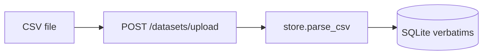

### Payoff

Show response: `dataset.id`, `preview` with 5 rows.

### Say

> “We’re not stuffing CSV into the LLM prompt. We **persist rows** first — that’s how real CVM pipelines scale.”

### End card

> “Rows are in the DB. Nothing is ‘analyzed’ yet. Next episode: one API call kicks off the pipeline.”

---

## Episode 2 — API + analyze endpoint (10–15 min)

**Goal:** One button concept — `POST /datasets/{id}/analyze`.

### Open `main.py`

Highlight three routes only:

- `POST /datasets/upload`
- `POST /datasets/{id}/analyze`
- `GET /datasets/{id}/insights`

### Open `pipeline/run.py`

> “Every analysis run goes through **one entry point**. Routes never call rules or LLM directly.”

```python
# pipeline/run.py — the only door into analysis
run_dataset_analysis(dataset_id, verbatims)
```

### Demo

```bash
DATASET_ID=<from upload>
curl -X POST http://localhost:8000/datasets/$DATASET_ID/analyze | jq '.rollup'
```

Show in response:

- `records[]` — per-verbatim insight
- `rollup` — theme counts, churn buckets

### Sequence diagram (show `docs/LANGGRAPH.md`)

Walk the flow: API → `run.py` → graph → save → response.

### Payoff

Pick one record — e.g. login + churn themes on `v-001`.

### Say

> “We got insights without training a model. Next episode: **how** — the LangGraph tree.”

### End card

Tease graph file: `graphs/verbatim_insights/graph.py`

---

## Episode 3 — LangGraph (25–35 min) ⭐ Main episode

**Goal:** Viewer can draw the graph from memory.

This is where you spend the most time. Split into **four acts**.

### Act A — Why a graph? (5 min)

**Don’t** open with LangGraph imports.

1. Whiteboard: list of 12 verbatims
2. “We need: skip junk → extract each → rollup once”
3. “That’s a **loop** + **batch** steps — LangGraph names those nodes.”

Show Echo comparison (one slide): same `prepare → analyze_one loop → finalize` pattern.

### Act B — Graph tree (8 min)

Open `docs/LANGGRAPH.md` or draw live:

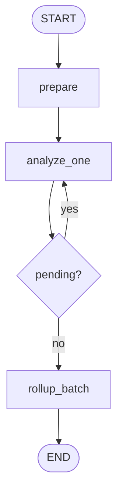

Then open `graph.py` line by line:

1. `StateGraph(InsightsGraphState)`
2. `add_node` × 3
3. `add_edge(START, "prepare")`
4. `add_conditional_edges` on `analyze_one` — **pause here**

> “This conditional edge is the loop. While `pending_ids` has items, we stay on `analyze_one`.”

Mention `recursion_limit = max(25, n + 10)` — LangGraph default is too low for 50+ rows.

### Act C — State + reducers (7 min)

Open `state.py`.

| Field | Why it matters on camera |
|-------|--------------------------|
| `pending_ids` | Queue — pop one per step |
| `records` | `operator.add` — **append** each step |
| `stats` | Merged counters across the loop |
| `rollup` | Set once at the end |

Demo trick: add a temporary `print(state["pending_ids"][:3])` in `analyze_one` and re-run CLI:

```bash
cd backend && python scripts/run_analysis.py
```

Viewer sees the queue shrink.

### Act D — `analyze_one` node (10 min)

Open `nodes.py` — follow the decision tree:

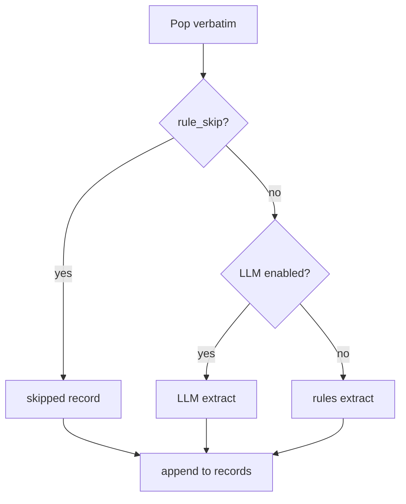

1. **`prepare`** — seeds `pending_ids` from all verbatim IDs
2. **`rule_skip`** — show `v-005` (“ok”) → skipped
3. **Rules path** — quick peek at `rules.py` theme table (don’t read every keyword)
4. **`rollup_batch`** — open `rollup.py`, show `Counter` over themes

### Payoff demo

Run analyze on sample; show:

- 11 analyzed, 1 skipped
- `top_themes`: `login_failure`, `competitor_switch`, …
- `high_churn_samples` — the Equity line

### Say (closing)

> “The graph is the product. Upload and UI are shells. In production you add cache nodes, parallel extract, narrative-on-rollups — same tree, more nodes.”

### End card

> “Next: rules engine for free demos, LLM for nuance — same graph, different branch.”

---

## Episode 4 — Rules vs LLM (15–20 min)

**Goal:** Two engines, one graph; explainable vs production quality.

### Part 1 — Rules (no API key)

Open `pipeline/rules.py`:

- `THEME_RULES` — show 3–4 rows live
- `rule_skip` — why “ok” never hits the extractor
- `_churn_risk` — competitor phrases

Run with **no** `.env`:

```bash
curl http://localhost:8000/health
# llm_enabled: false
```

> “Perfect for tests, offline demos, and **this YouTube series** without burning tokens.”

### Part 2 — LLM branch

Add to `backend/.env`:

```
OPENAI_API_KEY=sk-...
LLM_MODEL=gpt-4o-mini
```

Restart API. `build_initial_state` sets `engine=llm`.

Open `prompts/extract.py` — show system + user prompt shape (structured JSON keys match Pydantic).

Re-run analyze on same dataset; compare one **mixed** verbatim (`v-004` — love design + KYC pain).

### Side-by-side table (talking point)

| | Rules | LLM |
|--|-------|-----|
| Cost | Free | ~1 call / row |
| Explainability | Keyword tables | Prompt + audit |
| Mixed sentiment | Heuristic | Usually better |
| Demo without key | ✅ | ❌ |

### Say

> “Same nodes, same rollups. Only the **extract** step changes. That’s how you ship.”

---

## Episode 5 — Frontend dashboard (15–20 min)

**Goal:** End-to-end on screen — not localStorage mocks.

### Story

1. `frontend/lib/api.ts` — `uploadCsv`, `analyzeDataset`, `getInsights`
2. Upload zone → calls `POST /datasets/upload`
3. “Run analysis” → `POST /analyze` → store `rollup` in React state
4. KPI cards from `rollup.sentiment`, `rollup.churn_risk`, `rollup.top_themes`
5. Table: expand row → `themes`, `issues`, `delights`, `key_quote`

### Diagram

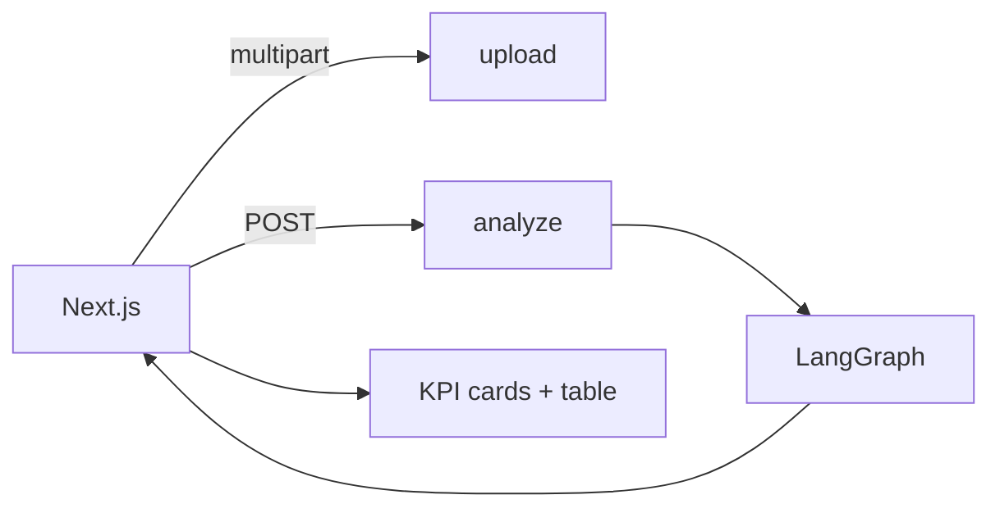

### Film the “wow” moment

1. Click **Load sample**
2. Click **Run analysis**
3. Point at **high churn** card — read the Equity verbatim aloud
4. Point at **top theme** bar — “login_failure” → backlog item for product

### Say

> “Frontend never computes insights. It **displays rollups** from the API — same contract a BI tool or Slack bot would use.”

---

## Episode 6 — Wrap + roadmap (8–12 min)

### Recap diagram (full stack)

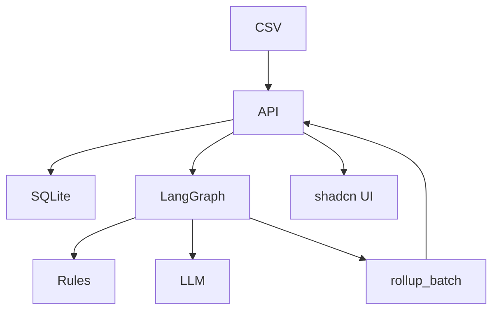

### Compare to Echo (honest)

| Insight Lab | Echo (full product) |
|-------------|---------------------|
| SQLite | Postgres + vectors |
| 3 graph nodes | + enrich, cache, dedup |
| CSV upload API | Multi-source ingest |
| Teaching repo | Production shape |

### Extensions tease (next videos / repo issues)

1. **Dedup cache node** — skip LLM on exact text
2. **Parallel `analyze_one`** — thread pool or LangGraph `Send`
3. **Narrative node** — LLM summary on rollups only
4. **Wire to CVM segments** — “customers who mentioned login_failure”

### CTA

- Link public repo
- “Star if you’re building CVM + AI”
- Comment: which extension to film next

---

## B-roll & screen recording tips

| Moment | What to capture |
|--------|-----------------|
| Graph compile | Scroll `graph.py` slowly |
| Loop living | CLI with debug print on `pending_ids` |
| Skip gate | `v-005` in CSV + skipped in JSON |
| Churn | `v-001` or `v-008` in `high_churn_samples` |
| Rollup math | `rollup.py` `Counter` — not magic |
| API contract | Swagger at `http://localhost:8000/docs` |

### Thumbnail ideas

- Graph tree on dark background + “Beyond Sentiment”
- Split: 😀/😡 vs “themes · churn · NPS”
- CSV → LangGraph → dashboard arrows

---

## Short-form clips (YouTube Shorts / LinkedIn)

| Clip | Hook | File |
|------|------|------|
| 60s | “Why positive % is useless” | `bank_verbatims.csv` row 1 |
| 45s | “This is the whole pipeline” | `graph.py` conditional edge |
| 30s | “Dashboard math is Python, not AI” | `rollup.py` Counter |
| 45s | “Same graph, rules or GPT” | `nodes.py` engine branch |

---

## Checklist before publish

- [ ] README quick start works on a clean machine
- [ ] Sample CSV loads via API
- [ ] Analyze returns rollup without API key
- [ ] `docs/LANGGRAPH.md` renders mermaid on GitHub
- [ ] Repo is public + LICENSE MIT
- [ ] Pin repo link in video description
- [ ] Chapters in description match episode timestamps

---

## Description template (copy-paste)

```
Insight Lab — beyond positive/negative sentiment analysis.

Built for customer verbatims: themes, churn risk, NPS class, issues & delights.
Stack: FastAPI · LangGraph · SQLite · Next.js · shadcn

Repo: <url>

Chapters:
0:00 Problem
2:30 CSV ingest
…

Part of the CVM-AI series — end-to-end AI projects for customer value management.
```

---

## Related docs

- [LANGGRAPH.md](LANGGRAPH.md) — graph reference + diagrams
- [ARCHITECTURE.md](ARCHITECTURE.md) — API + layers
- [diagrams/README.md](diagrams/README.md) — PNG export checklist for filming
- [README.md](../README.md) — quick start
